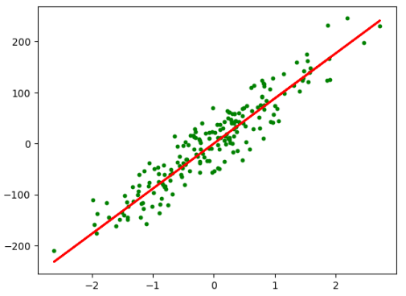

# Implementing ML Algorithms from Scratch

This repository contains simple and actual implementations of various machine learning algorithms from scratch. The goal is to provide clear, understandable code and explanations for these fundamental algorithms, helping learners better understand how they work internally.

### I will be updating implementation of all the algorithms regularly. Kindly do take a look and feel free to address any issues or modifications.

# Algorithms Implemented

### 1. **Linear Regression**
Linear regression is a fundamental algorithm in machine learning, used for predicting continuous values based on the linear relationship between input variables and the target variable. In this implementation, we calculate the parameters (slope and intercept) using the least squares method.

- **File**: `LinearRegression.ipynb`
- **Key Concepts**: Approximation, Gradient Descent, Least Squares, Model Fitting
- **Results**:


<p align="center">
  
</p>


### 2. **Logistic Regression**
Logistic regression is used for binary classification tasks. It models the probability of an event occurring based on input features. This implementation uses the sigmoid function to output probabilities.

- **File**: `LogisticRegression.ipynb`
- **Key Concepts**: Sigmoid Function, Cross-Entropy Loss, Gradient Descent

### 3. **Naive Bayes**
Naive Bayes is a probabilistic classifier based on Bayes’ Theorem, which assumes that features are independent given the class. It is especially useful for text classification and spam filtering.

- **File**: `naiveBayes.ipynb`
- **Key Concepts**: Conditional Probability, Bayes' Theorem, Gaussian Naive Bayes

### 4. **K-Nearest Neighbors (KNN)**
KNN is a simple, instance-based learning algorithm where the class of a data point is determined by the majority class of its neighbors. The algorithm is lazy, meaning it doesn’t learn a model but makes decisions based on the proximity to labeled points.

- **File**: `KNN.ipynb`
- **Key Concepts**: Euclidean Distance, Majority Voting, Lazy Learning

### 5. **Perceptron**
The perceptron is a linear classifier and the foundation of neural networks. It updates its weights through an iterative process to classify linearly separable data.

- **File**: `Perceptron.ipynb`
- **Key Concepts**: Linear Classifier, Weight Updates, Gradient Descent

### 6. **Support Vector Machine (SVM)**
SVM is a powerful classifier that finds the hyperplane that best separates data into classes. It aims to maximize the margin between classes, and uses kernel tricks for non-linear classification.

- **File**: `SupportVectorMachine.ipynb`
- **Key Concepts**: Hyperplanes, Margin Maximization, Kernel Trick

### 7. **Decision Tree**
A decision tree is a supervised learning algorithm that splits the data into subsets based on feature values to create a model that predicts the target variable. It builds a tree-like structure with decision nodes.

- **File**: `DecisionTree.ipynb`
- **Key Concepts**: Entropy, Gini Index, Recursive Partitioning

### 8. **Random Forest**
Random Forest is an ensemble learning method that constructs a collection of decision trees and outputs the majority class prediction (classification) or average prediction (regression).

- **File**: `RandomForest.ipynb`
- **Key Concepts**: Bagging, Feature Randomness, Ensemble Learning

### 9. **Principal Component Analysis (PCA)**
PCA is a dimensionality reduction technique that transforms data into a set of orthogonal components, reducing the number of variables while retaining the maximum variance.

- **File**: `PrincipalComponentAnalysis.ipynb`
- **Key Concepts**: Eigenvectors, Eigenvalues, Singular Value Decomposition (SVD)

### 10. **K-Means Clustering**
K-Means is an unsupervised learning algorithm that clusters data points into a predefined number of clusters based on their similarity, measured by Euclidean distance.

- **File**: `K-Means-Clustering.ipynb`
- **Key Concepts**: Centroids, Euclidean Distance, Iterative Optimization

### 11. **AdaBoost**
AdaBoost is an ensemble method that combines multiple weak classifiers to create a strong classifier by giving more weight to misclassified instances in subsequent rounds.

- **File**: `AdaBoost.ipynb`
- **Key Concepts**: Weak Learners, Weighted Voting, Iterative Training

### 12. **Linear Discriminant Analysis (LDA)**
LDA is a dimensionality reduction technique used to find the linear combination of features that best separates two or more classes.

- **File**: `LinearDiscriminantAnalysis.ipynb`
- **Key Concepts**: Between-Class Variance, Within-Class Variance, Eigenvectors

---

## Installation

To run this notebook, ensure the following prerequisites are installed:
- Scikit-Learn
- NumPy
- Matplotlib

Install the required dependencies with:
```bash
pip install -r requirements.txt
```

---

# How to Use

1. Clone the repository:
   ```bash
   git clone https://github.com/THAMIZH-ARASU/Implementing-ML-Algorithms-from-Scratch.git
   ```
2. Open the notebook:
   ```bash
   jupyter notebook LinearRegression.ipynb
   ```
---

# License

This project is licensed under the MIT License. See the `LICENSE` file for details.

---

<p align="center">
  <b align="center">
    <h1 align="center">TOGETHER... WE GROW!!!</h1>
  </b>
</p>


